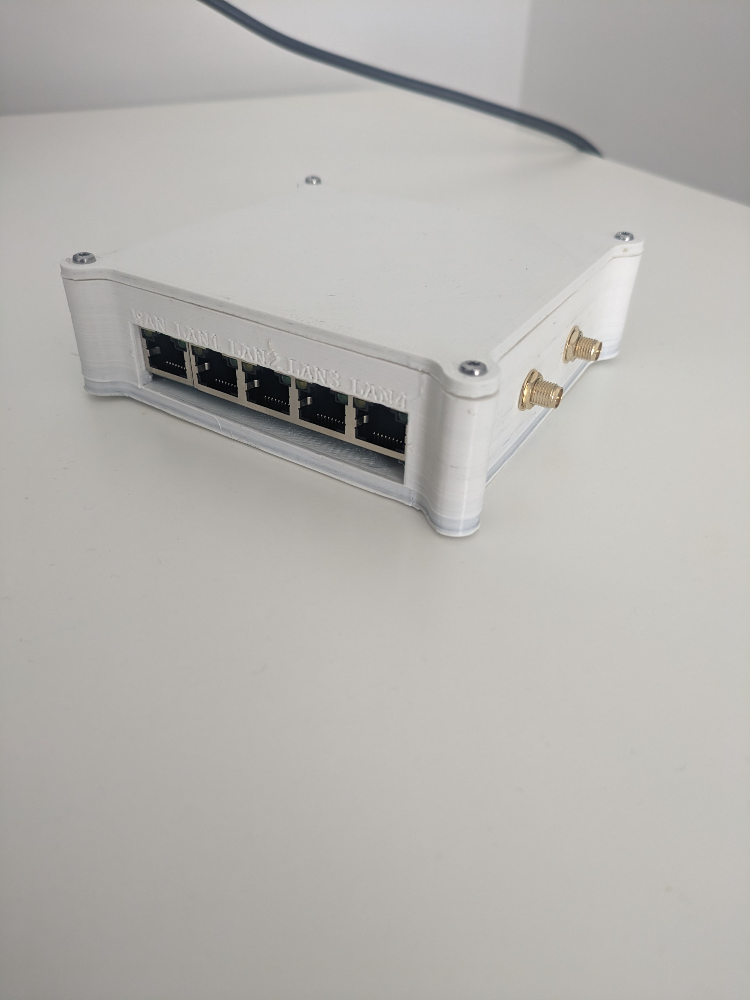

# Description
This is a simple case to enclose the [HiLink 7628N router dev kit module](https://pt.aliexpress.com/item/4001264416148.html?spm=a2g0o.order_list.order_list_main.32.21efcaa4HPOalR&gatewayAdapt=glo2bra). 

It was built with FreeCAD and you can find the project files in the `FreeCAD` folder.

After printing, it should look like this

Despite having some warp due to printer misconfiguration, mine came out like this

